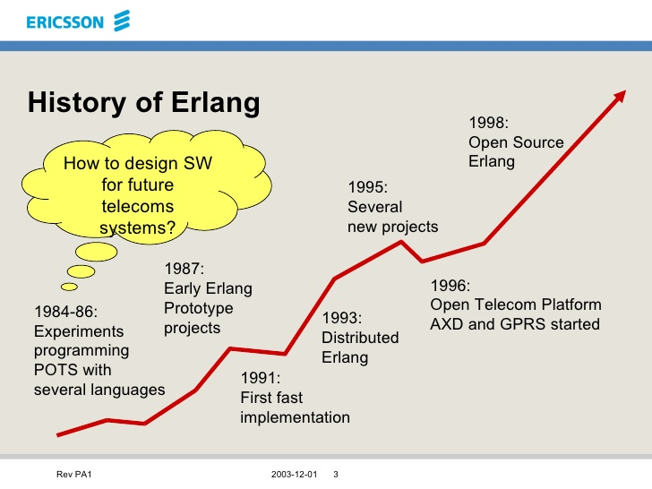

#HSLIDE
## Процеси

#HSLIDE


#HSLIDE
## Съдържание

0. Представяне
1. Процеси в Erlang - как и защо? Малко история.
2. Конкурентност и паралелизъм
3. Комуникация между процеси

#HSLIDE
## Кой съм аз?

* Николай Цветинов (Meddle)
* Баща <!-- .element: class="fragment" -->
* Работя в транспорта <!-- .element: class="fragment" -->
* elixir-lang.bg <!-- .element: class="fragment" -->

#HSLIDE


#HSLIDE
## Кои сте вие?

* Вие използвате Elixir!
* Или искате да използвате Elixir? <!-- .element: class="fragment" -->
* Или пък Erlang?? <!-- .element: class="fragment" -->
* Или сте HYPE-нати от тези технологии? <!-- .element: class="fragment" -->
* Или просто сте дошли за бира?! <!-- .element: class="fragment" -->

#HSLIDE


#HSLIDE

* За каквото и да сте дошли - бира ще има!
* Ще си говорим и за процеси! <!-- .element: class="fragment" -->
* Да, така известните BEAM процеси <!-- .element: class="fragment" -->
* И ще почнем от самото начало, така че : ERLANG! <!-- .element: class="fragment" -->

#HSLIDE
## Процеси в Erlang - как и защо? Малко история.

#HSLIDE


#HSLIDE


#HSLIDE
* Erlang е създаден в лаборатория на Ericsson през 80-те години.
* Основната му идея е да е способ за писане на конкурентни програми, които трябва да могат да се изпълняват безкрайно. <!-- .element: class="fragment" -->

#HSLIDE
### Joe Armstrong


#HSLIDE
#### По-добър начин за писане на Телеком програми.


#HSLIDE
### Телеком програми
* Конкурентни (едно устройство трябва да може да поддържа хиляди едновременни транзакции).
* Толерантни към грешки и проблеми, както софтуерни, така и хардуерни.  <!-- .element: class="fragment" -->
* Практически нулев downtime.  <!-- .element: class="fragment" -->
* Кодът им да може да се заменя с по-нови версии, докато те работят.  <!-- .element: class="fragment" -->

#HSLIDE
#### А какви проблеми имаме днес?


#HSLIDE


#HSLIDE


#HSLIDE


#HSLIDE


#HSLIDE
#### Сериозно, да продължим напред: Говорехме за история на Erlang!


#HSLIDE
### AXE и PLEX


#HSLIDE
### AXE и PLEX
* Erlang е трябвало да бъде нещо като PLEX.
* Но да върви на различни типове хардуер.  <!-- .element: class="fragment" -->
* И да е по-бърз и лесен за писане. <!-- .element: class="fragment" -->

#HSLIDE


#HSLIDE
### AXE и PLEX
* Множество паралелни процеси живеят в паметта.
* По всяко време, повечето от тях чакат събитие. <!-- .element: class="fragment" -->
* Когато събитие се случи, процесът прави някакво изчисление, променя си състоянието или изпраща съобщение, след което пак чака. <!-- .element: class="fragment" -->

#HSLIDE
### AXE и PLEX
* Процесите трябва да са много леки и лесни за създаване.
* Процесите трябва да са част от самия език.  <!-- .element: class="fragment" -->
* Грешките в един процес не могат да влияят на другите процеси.  <!-- .element: class="fragment" -->

#HSLIDE
### AXE и PLEX
* По онова време паралелизъм означава множество устройства, които работят с дадения софтуер и се възприемат като едно.
* Тоест езикът трябва да е лесен за дистрибутивност.

#HSLIDE


#HSLIDE
### Erlang!
1. Кодът върви в процеси, които са на ниво език.
2. Тези процеси не споделят памет - имат собствен стек и собствен heap. <!-- .element: class="fragment" -->
3. Много са лесни за създаване и си комуникират чрез размяна на съобщения.  <!-- .element: class="fragment" -->
4. Лесно могат да си комуникират помежду си, дори да са на различни машини. <!-- .element: class="fragment" -->
5. Ако един процес 'умре', другите продължават да живеят. Може нов да го замести, зависи от стратегията. <!-- .element: class="fragment" -->

#HSLIDE


#HSLIDE
* Erlang започва като библиотека на Prolog за fault-tolerant and distributed програмиране.
* Развива бързо като диалект на пролог. <!-- .element: class="fragment" -->
* Първият интерпретатор на езика е на Prolog. <!-- .element: class="fragment" -->
* Erlang е повлиян донякъде и от Smalltalk. <!-- .element: class="fragment" -->

#HSLIDE
* Erlang не е повлиян от и не имплементира Actor модела.
* Процесите на Erlang и актьорите имат общ предшественик - комуникацията между обекти със съобщения.   <!-- .element: class="fragment" -->
* Доста от идеите за Актьорите намират своят път в процесите на Erlang независимо от Actor модела.  <!-- .element: class="fragment" -->
* Вътрешността на един процес няма нищо общо с Actor модела.  <!-- .element: class="fragment" -->

#HSLIDE
### Robert Virding


#HSLIDE
* Erlang се превръща от Prolog, който поддържа конкурентност в обособен език.
* Започва да работи още един човек - Robert Virding.  <!-- .element: class="fragment" -->
* Двамата с Joe Armstrong оформят паралелно два интерпретатора на Erlang, написани на Prolog.  <!-- .element: class="fragment" -->
* Erlang придобива потребители - 3-ма човека.  <!-- .element: class="fragment" -->

#HSLIDE
* Процесите започват да имат специален буфер, наречен 'кутия за съобщения' Mailbox.
* Започват да могат да създават връзки помежду си.  <!-- .element: class="fragment" -->
* Ако някой от тях получи грешка, друг може да бъде уведомен със специално съобщение и да реагира.  <!-- .element: class="fragment" -->

#HSLIDE


#HSLIDE
* В края на 1989 година, езикът е тестван и функционалността му е намерена за задоволителна.
* Проблемът е че е много бавен.
* Излиза ново изискване - да го направят поне 40 пъти по-бърз, което после се увеличава.

#HSLIDE
### Mike Williams


#HSLIDE
* Ражда първата абстрактна машина на Erlang, написана на C - JAM.
* Преди C и други езици са разглеждани, и други абстрактни машини са разучавани.   <!-- .element: class="fragment" -->
* Mike Williams е с доста повече опит от Joe в C, затова той написва JAM.   <!-- .element: class="fragment" -->

#HSLIDE


#HSLIDE
* 90-те години бележат началото на изхвърляне на доста Prolog синтаксис от Erlang
* По добри GC стратегии.
* Binary информация над даден размер да се пази в общ heap за даден node
* ...

#HSLIDE


#HSLIDE
* През 1993 Bogumil (Bogdan) Hausman създава TEAM, прекръстена после на BEAM
* Доста по-оптимизирана машина за изпълнение на Erlang bytecode.

#HSLIDE
Две хубави неща се случват за Erlang:
1. В края на 1995, проекта за AXE-N устройствата се сгромолясва.
2. През 1998 година Ericsson Radio AB забранява Erlang за ползване.

#HSLIDE


#HSLIDE
### OTP
* Множество малки помощни библиотеки на Erlang.
* Design Patterns за програмирани на често желани програми.
* Документация, курсове и How to-та
* Mnesia/ETS бази данни

#HSLIDE


#HSLIDE
Joe Armstrong нарича Erlang език за конкурентно-ориентирано програмиране, като се базира на няколко правила.

#HSLIDE
* Системата е изградена от процеси.
* Процесите не споделят нищо.  <!-- .element: class="fragment" -->
* Процесите си комуникират чрез асинхронно изпращане на съобщения.  <!-- .element: class="fragment" -->
* Процесите са изолирани един от друг.  <!-- .element: class="fragment" -->

#HSLIDE
### Заключение:
1. 1986 : Erlang е декларативен език с добавена способност за конкурентно изпълнение.
2. 1995 : Erlang е функционален език с добавена способност за конкурентно изпълнение.
3. 2005 : Erlang е конкурентно-ориентиран език, който се състои от комуникиращи си компоненти, написани на функционален език.

#HSLIDE


#HSLIDE
## Конкурентност и паралелизъм


#HSLIDE
* Когато стартираме Elixir, той върви в един OS process или една BEAM инстанция, която наричаме node.
* За всяко ядро на CPU-то си, обикновено получаваме по една OS-level нишка.   <!-- .element: class="fragment" -->
* Във всяка такава нишка се изпълнява Scheduler.   <!-- .element: class="fragment" -->
* Scheduler-ите обикновено са обвързани с ядро на процесора, но е възможно и да ги сменят.   <!-- .element: class="fragment" -->

#HSLIDE
* Един Scheduler управлява опашка, наречена run queue.
* Това е приоритетна опашка от Elixir процеси и портове. <!-- .element: class="fragment" -->
* Това значи че ако имаме четири Scheduler-а е възможно да имаме четири паралелни Elixir-level процеса. <!-- .element: class="fragment" -->

#HSLIDE


#HSLIDE
* При създававане на процес, той се поставя в някоя от опашките.
* Един Elixir-level процес е голям около 1KB-2KB при създаването си.  <!-- .element: class="fragment" -->
* Можем да създаваме огромен брой процеси без да се притесняваме. Говорим за милиони.  <!-- .element: class="fragment" -->

#HSLIDE
* Процесите и портовете имат право на до N редукции.
* Всяка операция свързана с процес е редукция.  <!-- .element: class="fragment" -->
* Когато текущо-изпълняващ се процес изчерпа редукциите си или пък е в очакване на нещо и не прави нищо, той става неактивен.   <!-- .element: class="fragment" -->
* По тежките операции са по скъпи.   <!-- .element: class="fragment" -->

#HSLIDE
* Възможно е процес да смени опашката си и да започне да се управлява от друг Scheduler.
* Има сложен алгоритъм за балансиране на натоварването между ядрата. <!-- .element: class="fragment" -->
* Често ако Scheduler остане без работа може да си 'поиска' процеси. <!-- .element: class="fragment" -->

#HSLIDE


#HSLIDE
### Preemptive (превантивна стратегия)


#HSLIDE
## Комуникация между процеси


#HSLIDE
Има три основни функции за работа с процеси:
* spawn ги създава.
* send изпраща съобщение до процес.
* receive чака за съобщения към текущия процес.

#HSLIDE
```elixir
pid = spawn(action)

send(pid, message)
```

#HSLIDE
```elixir
pid = spawn(fn ->
  receive do
    pattern1 -> action1
    pattern2 -> action2
    ....
    patternN -> actionN
  end
end)

send(pid, pattern2)
```

#HSLIDE
```elixir
pid = spawn(fn ->
  receive do
    :say_hi -> IO.puts("Hi!")
    :say_by -> IO.puts("Bye!")
    {:say, name, msg} -> IO.puts([name, " says ", msg])
  end
end)

send(pid, {:say, "Arnold", "I'll be back!"})
```

#HSLIDE
* Receive е като case, който се изпълнява върху полученото съобщение.
* Съобщението може да е всякакъв тип.
* Можем да изпратим `PID`-а на процеса, който извиква `send` и да го използваме за да получим отговор.

#HSLIDE
```elixir
pid = spawn(fn ->
  receive do
    {sender, :ping} when is_pid(sender) ->
      send(sender, {self(), :pong})
  end
end)

send(pid, {self(), :ping})
IO.puts("Let's wait for a pong!")

receive do
  {sender, :pong} when is_pid(sender) ->
    IO.puts([inspect(sender), " sends PONG!"])
end
```

#HSLIDE
## Паралелен Enum.map


#HSLIDE
```elixir
1..50 |> Enum.map(fn x -> x * x end)
```

#HSLIDE
```elixir
defmodule PEnum do
  def map(enumerable, map_func) do
    enumerable
    |> Enum.map(spawn_func(map_func))
    |> Enum.map(&receive_func/1)
  end
end
```

#HSLIDE
```elixir
defp spawn_func(map_func) do
  current_pid = self()
  fn x ->
    spawn(fn ->
      send(current_pid, {self(), map_func.(x)})
    end)
  end
end

defp receive_func(pid) do
  receive do
    {^pid, result} -> result
  end
end
```

#HSLIDE
```elixir
1..50 |> Enum.map(fn x -> :timer.sleep(1000); x* x end)
# След около 50 секунди ще имаме квадратите

1..50 |> PEnum.map(fn x -> :timer.sleep(1000); x* x end)
# След около секунда ще имаме квадратите
```

#HSLIDE


#HSLIDE
* Процесите в Elixir са много леки и лесни за употреба
* Не споделят данни.
* Могат да се изпълняват паралелно.

#HSLIDE
## Край

